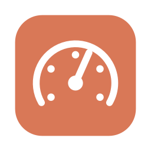
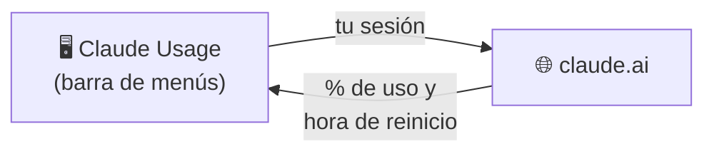

<div align="center">



# Claude Usage

**Tus límites de uso de Claude, siempre a la vista en la barra de menús de tu Mac.**

[](#-requisitos)
[](https://www.swift.org)
[](LICENSE)
[](#-licencia)

[Qué hace](#-qué-hace) •
[Instalación](#-instalación) •
[Cómo funciona](#-cómo-funciona) •
[Privacidad](#-privacidad) •
[Contribuir](#-contribuir)

</div>

<br>

> [!IMPORTANT]
> **Proyecto no oficial.** No está afiliado, respaldado ni patrocinado por Anthropic.
> "Claude" es una marca registrada de Anthropic, PBC. Antes de usarla, échale un ojo al [aviso](#-aviso).

¿Te ha pasado que estás a media chamba con Claude y de repente te topas con el límite?
**Claude Usage** te muestra en todo momento cuánto llevas usado, sin tener que abrir
claude.ai → Ajustes → Uso cada rato.

## ✨ Qué hace

| Característica | Descripción |
|---|---|
| 📊 **Siempre a la vista** | La barra de menús muestra el % usado de tu sesión actual (5 horas). |
| 🗂️ **Todos tus límites** | Sesión de 5 h, semanal, por modelo (Opus, Sonnet) y los que Anthropic agregue después. |
| ⏱️ **Cuenta regresiva** | Te dice exactamente cuándo se reinicia cada límite. |
| 🚦 **Colores de alerta** | La barra se pone naranja a partir del 75 % y roja a partir del 90 %. |
| 🔄 **Se actualiza sola** | Cada minuto mientras estás usando Claude; más espaciado (hasta cada 5 min) cuando no. |
| 🚀 **Arranca con tu Mac** | Se abre sola al iniciar sesión. Lo puedes desactivar desde el menú. |

## 📋 Requisitos

- **macOS 13 Ventura** o más reciente.
- **Swift 5.9** o más reciente para compilarla. Viene con Xcode o con las herramientas
  de línea de comandos, que puedes instalar con:

  ```bash
  xcode-select --install
  ```

## 📦 Instalación

### Opción 1: compilar e instalar de un jalón (recomendada)

```bash
git clone https://github.com/IFEE09/claude-usage.git
cd claude-usage
./build.sh --install
```

¡Y listo! La app queda en **Aplicaciones**, se abre sola y aparece en tu barra de menús.
Si ya la tenías instalada, este mismo comando la cierra y la reemplaza por la versión nueva.

### Opción 2: generar el DMG

```bash
./build.sh
```

Esto crea `build/ClaudeUsage.dmg`. Ábrelo y arrastra **Claude Usage** a la carpeta
**Aplicaciones**. Sirve para pasársela a alguien más.

> [!WARNING]
> **¿Te pasaron el DMG?** La app no está notarizada por Apple, así que la primera vez
> macOS la va a bloquear. Ábrela, cierra el aviso y ve a
> **Ajustes del Sistema → Privacidad y seguridad → Abrir de todos modos**.
> Instala solo compilaciones de gente de confianza; lo más seguro es que la compiles tú.

### Primeros pasos

1. Da clic en el ícono de la barra de menús y luego en **Iniciar sesión…**
2. Entra a tu cuenta de claude.ai como siempre (correo, Google o Apple).
3. La ventana se cierra sola y tus límites aparecen en unos segundos. 🎉

## ⚙️ Cómo funciona



1. Inicias sesión en claude.ai dentro de una ventana de la app. **La app nunca ve tu
   contraseña**: el inicio de sesión lo hace la página oficial de claude.ai.
2. Tu sesión se guarda en el almacenamiento propio de la app, igual que en un navegador.
3. Una vista web oculta consulta los mismos datos que usa la página de uso de claude.ai:
   `/api/organizations` y `/api/organizations/{id}/usage`.
4. **Cerrar sesión** borra todos los datos web que guardó la app.

<details>
<summary><b>¿Cada cuánto se actualiza?</b></summary>

<br>

- Cada **minuto** mientras tu uso está cambiando.
- Si no cambia, el intervalo se va duplicando hasta llegar a **5 minutos**.
- Al **abrir el menú**, si los datos tienen más de un minuto.
- Al **despertar tu Mac**.
- **Justo después** de que se reinicia un límite.

</details>

## 🔒 Privacidad

- ✅ Solo se conecta a `claude.ai` (y al proveedor de inicio de sesión que tú elijas).
- ✅ Sin analíticas, sin telemetría y sin mandar datos a terceros.
- ✅ **No lee ni guarda tus conversaciones**: solo los porcentajes de uso.
- ✅ Lo único que guarda en tu Mac es el ID de tu organización y si ya se configuró el
  arranque automático.
- ✅ Código 100 % abierto: puedes revisar cada línea.

## 🗂️ Estructura del proyecto

```
claude-usage/
├── Sources/ClaudeUsage/
│   ├── ClaudeUsageApp.swift          → Punto de entrada; ícono y texto de la barra de menús
│   ├── MenuView.swift                → El panel que se abre desde la barra de menús
│   ├── UsageStore.swift              → Estado, actualización automática y lectura de los límites
│   ├── ClaudeClient.swift            → Consultas a claude.ai desde una vista web oculta
│   └── LoginWindowController.swift   → Ventana de inicio de sesión (y ventanas de Google / Apple)
├── scripts/make_icon.swift           → Dibuja el ícono de la app
├── Resources/Info.plist              → Datos del paquete de la app
└── build.sh                          → Compila, arma el .app, lo firma y crea el DMG
```

## 🚨 Aviso

- **No es oficial.** Los datos se leen de endpoints internos de claude.ai que no están
  documentados. Anthropic los puede cambiar cuando quiera, y la app dejaría de funcionar
  hasta que se ajuste el código.
- **Tu cuenta, tu decisión.** La app consulta claude.ai de forma automática con tu sesión,
  como máximo una vez por minuto. Revisa los
  [Términos de uso de Anthropic](https://www.anthropic.com/legal/consumer-terms) y decide
  si quieres usarla. Los autores no se hacen responsables de lo que pase con tu cuenta.
- Se ofrece **"tal cual"**, sin garantías de ningún tipo (consulta la licencia).

## 🤝 Contribuir

¡Toda ayuda es bienvenida! Abre un [issue](https://github.com/IFEE09/claude-usage/issues)
si encuentras un error o tienes una idea, o manda un pull request.

> [!TIP]
> Si la app deja de mostrar tus límites, lo más probable es que Anthropic haya cambiado
> la respuesta del endpoint. Casi siempre basta con ajustar `parseLimits` y `title(for:)`
> en [`UsageStore.swift`](Sources/ClaudeUsage/UsageStore.swift).

## 📄 Licencia

Distribuida bajo la [Licencia Apache 2.0](LICENSE). Es un proyecto **gratuito y sin fines
de lucro**: úsala, compártela y mejórala con toda libertad.

<br>

<div align="center">

Hecho con ❤️ en México para la comunidad latina

</div>
